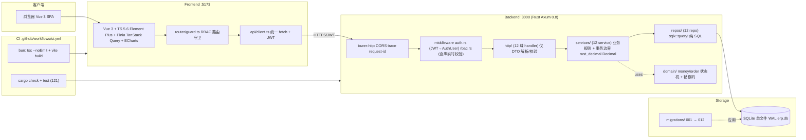
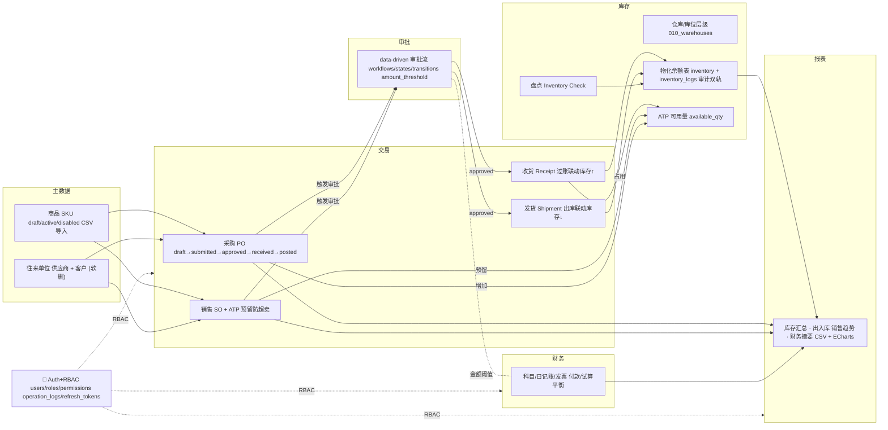

# Ikari_Shinji — ERP v2 架构图

> 版本：v2.0-alpha · 生成于 2026-08-12
> 绘制依据：实读 backend/src/** frontend/src/** AGENTS.md docs/detailed-design.md
> 渲染：以下为 Mermaid 图，GitHub/GitLab 原生支持渲染。

---

## 图 1 · 系统总体架构（请求链路 + 技术栈）



**关键纪律**
- Handler 只做 DTO 解析/校验 + 调 service，不含 SQL、不含事务。
- Service 持有事务边界（.begin/.commit/.rollback）+ 业务规则 + Decimal 计算。
- Repo 纯 SQL，返回 domain 结构，不含事务、不含业务。
- RBAC 每请求查库注入 AuthUser，JWT 不缓存权限。

---

## 图 2 · 后端分层架构（http → services → repos → SQLite）

```mermaid
flowchart TB
    subgraph HTTP["http/ (12 handler 文件)"]
        direction LR
        H1[auth] H2[catalog] H3[parties] H4[locations] H5[inventory]
        H6[purchase] H7[sales] H8[receipt] H9[shipment] H10[workflow]
        H11[finance] H12[reports]
    end

    subgraph MW2["middleware"]
        AUTH["auth.rs JWT → AuthUser"]
        RBAC["rbac.rs require_permission / require_admin"]
    end

    subgraph SVC2["services/ (12 service)"]
        direction LR
        S1[auth_service] S2[catalog_service] S3[parties_service]
        S4[location_service] S5[inventory_service] S6[purchase_service]
        S7[sales_service] S8[receipt_service] S9[shipment_service]
        S10[workflow_service] S11[finance_service] S12[reports_service]
    end

    subgraph REPO2["repos/ (12 repo + 纯 SQL)"]
        direction LR
        R1[auth_repo] R2[catalog_repo] R3[parties_repo] R4[location_repo]
        R5[inventory_repo] R6[purchase_repo] R7[sales_repo] R8[workflow_repo]
        R9[finance_repo] R10[reports_repo] R11[check_repo] R12[receivable_repo]
    end

    DOMAIN2[("domain/ money · order")]
    POOL[("SqlitePool sqlx 0.8")]

    AUTH --> RBAC
    RBAC --> HTTP
    HTTP --> SVC2
    SVC2 --> REPO2
    SVC2 -. uses .-> DOMAIN2
    REPO2 --> POOL
```

**DI 模式**：Axum Extension(pool) + Extension(JwtSecret) 注入；每请求 Service 从 pool 取连接。

---

## 图 3 · 业务模块关系（8 大 + Auth + 审批 + 报表）



**核心闭环**：采购 → 入库 → 库存 → 销售 → 出库 → 财务 → 报表，全程经审批流。

---

## 图 4 · 数据库迁移演化（001 → 012，含 Spec Drift 叠加）

```mermaid
flowchart LR
    M1["001_auth_rbac.sql users/roles/permissions operation_logs/refresh_tokens"]
    M2["002_catalog.sql items (SKU master)"]
    M3["003_parties.sql suppliers/customers"]
    M4["004_inventory.sql locations/inventory/logs"]
    M5["005_purchasing.sql purchase_orders/items"]
    M6["006_sales.sql sales_orders/items/reservations"]
    M7["007_finance.sql accounts/journal/invoices/payments"]
    M8["008_workflow.sql workflows/states/transitions instances/tasks (doc_status INTEGER)"]
    M9["009_seed.sql admin/manager/finance 11 permissions"]
    M10["010_warehouses.sql ⚡ ALTER locations.warehouse_id + deleted_at (在 child 之后 ALTER)"]
    M11["011_seed_workflows.sql ⚡ PO/SO 种子 workflows 4 states + 3 transitions"]
    M12["012_workflow_threshold.sql ⚡ ALTER workflow_transitions .amount_threshold TEXT"]

    M1 --> M2 --> M3 --> M4 --> M5 --> M6 --> M7 --> M8 --> M9 --> M10 --> M11 --> M12

    M4 -. 被 M10 ALTER .-> M10
    M8 -. 被 M10/M12 ALTER .-> M10
    M8 -. 被 M12 ALTER .-> M12
```



> ⚡ 标记 = Spec Drift 叠加迁移（已执行迁移绝不改，规则 #234）。
> 详见 AGENTS.md「Spec Drift 全记录」7 条。

---

## 图 5 · 前端结构（views / components / stores / api / router）

```mermaid
flowchart TB
    subgraph ENTRY["入口"]
        MAIN["main.ts"]
        APP["App.vue"]
    end

    subgraph ROUTER["router/"]
        INDEX["index.ts (路由表)"]
        GUARD["guard.ts RBAC 守卫 + 404"]
    end

    subgraph STORE["stores/"]
        AUTHS["auth.ts (JWT/用户/权限)"]
        PINIA["pinia.ts"]
    end

    subgraph API["api/"]
        CLIENT["client.ts fetch + Authorization Bearer"]
    end

    subgraph COMP["components/ (8 个复用控件)"]
        C1[CrudList] C2[DataTable] C3[StatusTag] C4[PermissionButton]
        C5[SearchBar] C6[EmptyState] C7[LoadingOverlay]
    end

    subgraph COMP2["composables/"]
        UHP["useHasPermission.ts"]
    end

    subgraph VIEWS["views/ (60+ 页面)"]
        direction LR
        V_AUTH[Login · NotFound · Profile · OperationLogs]
        V_ITEMS[items: List · Form · CSV 导入]
        V_PART[customers · suppliers]
        V_LOC[warehouses · locations]
        V_INV[inventory: List · Logs · StockAvailable Check: List · Detail Inbound: List · Form Outbound: List · Form]
        V_PO[purchase: List · Form · Detail]
        V_SO[sales: List · Form · Detail]
        V_WF[workflow: Instances · Tasks]
        V_FIN[finance: Accounts · Journal · Invoices Payments · TrialBalance]
        V_REP[reports: InventorySummary · InboundOutbound SalesTrend · FinanceSummary ECharts]
        V_USR[users: List · Form]
    end

    STYLE[("styles/main.css 深灰侧边栏 + 过渡动画")]

    MAIN --> APP --> INDEX
    INDEX --> GUARD
    GUARD -. 读 .-> AUTHS
    APP --> STYLE
    INDEX --> VIEWS
    VIEWS --> COMP
    VIEWS --> UHP
    VIEWS --> CLIENT
    CLIENT -. 携带 .-> AUTHS
    AUTHS --> PINIA
```

**RBAC 前端闭环**：
1. Login.vue → 调 /auth/login 拿 JWT → 写 stores/auth.ts
2. 每次路由跳转 → guard.ts 校验 meta.requiresPermission
3. 按钮级 → PermissionButton + useHasPermission
4. 请求统一经 api/client.ts 加 Authorization: Bearer
5. 权限名与后端对齐：item.read stock.read order.read order.approve finance.read report.read user.manage

---

## 附：技术依赖矩阵

| 层 | 关键依赖 |
|---|---|
| 后端 | Axum 0.8 (macros/multipart) · SQLx 0.8 (sqlite/chrono/uuid/json) · tokio · jsonwebtoken 9 · argon2 0.5 · rust_decimal · sha2 · csv 1.3 · tower-http 0.6 (cors/trace/request-id) · validator 0.19 |
| 前端 | Vue 3.5 · TS 5.6 · Element Plus 2.8 · Pinia 2.2 · TanStack Vue Query 5.5 · ECharts 6.1 · Vue Router 4.4 · Vite 6 · vue-tsc 2.2 (bun) |

---

## 附：测试与质量门禁

| 门禁 | 命令 | 当前 |
|---|---|---|
| 后端单测+集成 | cargo test --all (backend) | ✅ 121 全绿 |
| 后端编译 | cargo check --all-targets | ✅ |
| 前端类型 | bunx tsc --noEmit (frontend) | ✅ |
| 前端构建 | bun run build | ✅ |
| CI 自动 | .github/workflows/ci.yml | ✅ 双 job |
